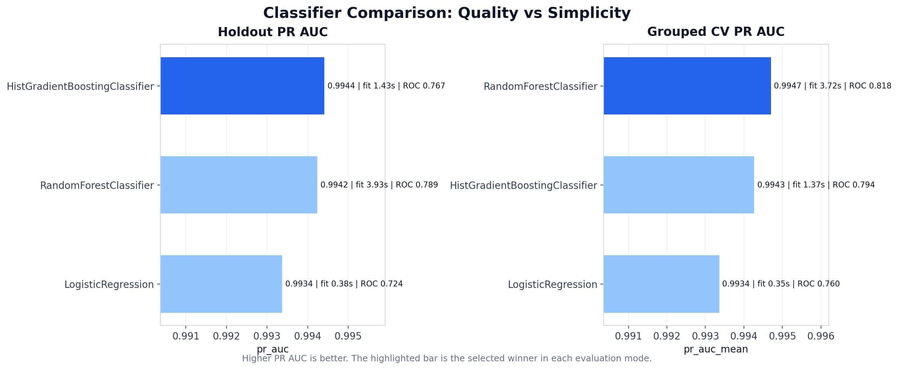
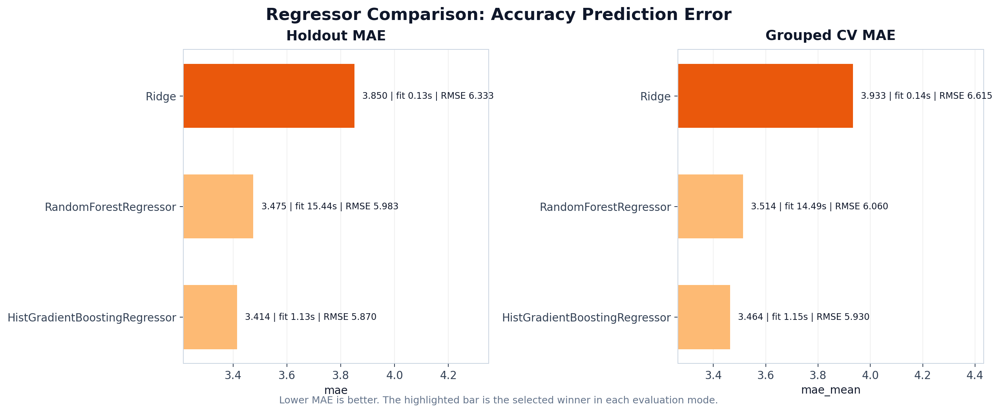
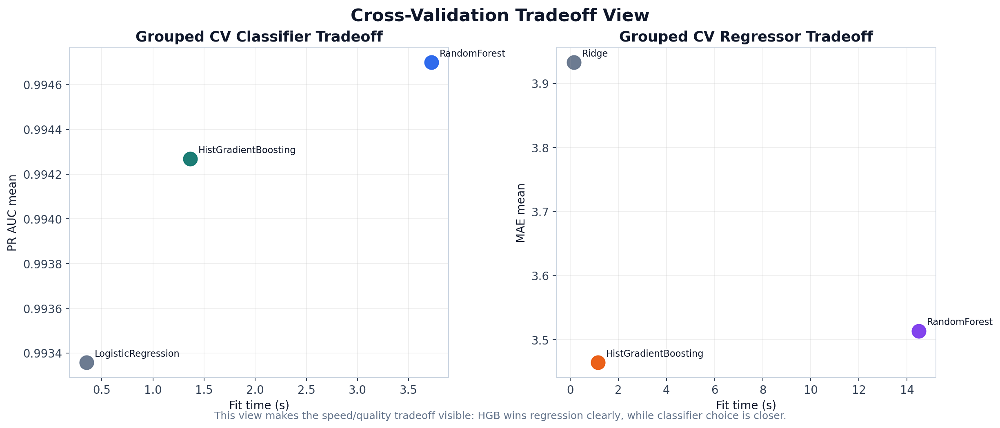
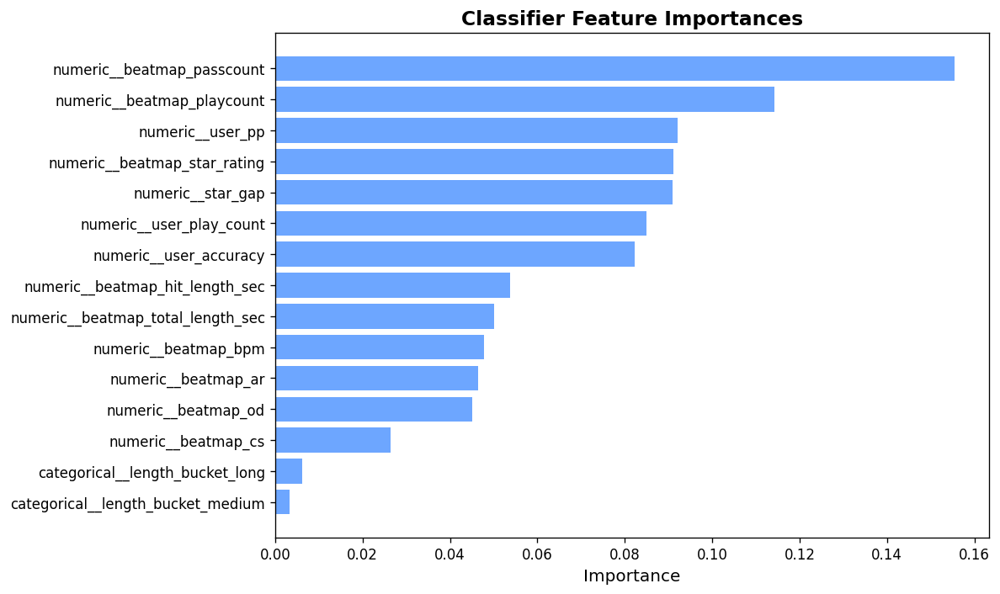

# osu-skill-predictor

`osu-skill-predictor` is a small classical ML project that predicts:

- the probability that a player will pass an osu! standard beatmap;
- the expected accuracy percentage for that attempt.

## Quick Start for Players

> **Want predictions while you play?** Grab the standalone bundle — no Python needed.

**[Player Guide &mdash; download, setup, overlay →](docs/standalone_player_guide.md)**

1. Download `osu-skill-predictor-web.zip` from the [latest release](https://github.com/nayutalienx/osu-skill-predictor/releases/latest)
2. Extract and run `osu-skill-predictor-web.exe`
3. Enter your osu! API v2 credentials, then save
4. Enable the overlay in settings (off by default)

An always-on-top overlay shows pass probability and predicted accuracy for every beatmap. Overlay works in **windowed or borderless** mode.

---

The project is intentionally shaped like a lightweight production ML service:

- local dataset collection and training workflow;
- serialized scikit-learn model artifacts;
- FastAPI inference API;
- automated tests;
- notebook support for interactive comparison and training.

## Current Status

Implemented:

- dataset collection and profiling;
- baseline feature engineering;
- grouped holdout and grouped cross-validation model comparison;
- canonical saved winner models in `models/`;
- FastAPI `GET /health` and `POST /predict`;
- automated tests for features, model loading, comparison, and API endpoints.

Current canonical models:

- classifier: `RandomForestClassifier`
- regressor: `HistGradientBoostingRegressor`

These were selected from the comparison workflow and saved as:

- `models/pass_model.joblib`
- `models/accuracy_model.joblib`

## Dataset

The current training dataset is a real API-backed `osu!` standard attempt dataset collected from the osu! API v2.

Key properties:

- source file: `data/raw/osu_country_try_data_full_20260601T074107Z/osu_country_try_data_v1.csv`
- row granularity: one row = one observed player attempt on one beatmap
- ruleset scope: `osu` standard only
- collection strategy: country-seeded sampling with recent and top score pulls per sampled player
- cleaned modeling rows: `184,229`
- raw loaded rows: `184,615`
- unique users: `9,999`
- unique beatmaps: `35,261`

The dataset was built to support two targets:

- `target_passed` for pass/fail classification
- `target_accuracy` for regression of expected accuracy percentage

For more detail on provenance and schema decisions, see:

- [docs/data_provenance.md](docs/data_provenance.md)
- [docs/dataset_schema.md](docs/dataset_schema.md)
- [docs/raw_data_validation.md](docs/raw_data_validation.md)

## Model Comparison

Model selection is not based on a single training run. The project includes both:

- grouped holdout evaluation by `user_id`
- grouped cross-validation for a more stable comparison view

The current saved winners follow the stronger grouped cross-validation view:

- classifier winner: `RandomForestClassifier`
- regressor winner: `HistGradientBoostingRegressor`

Why these won:

- `RandomForestClassifier` was the most reliable classifier under grouped cross-validation, with the best mean `PR AUC` and stronger separation than the other candidates.
- `HistGradientBoostingRegressor` won both holdout and grouped cross-validation on regression quality while also training much faster than the random forest regressor.

### Classifier Comparison



### Regressor Comparison



### Cross-Validation Tradeoff View



The practical takeaway is:

- classifier choice is close, so grouped CV matters more than a single split
- regressor choice is stable, and `HistGradientBoostingRegressor` is clearly the strongest default
- fit time is already good enough for local retraining and interactive notebook work

## Feature Importances

Feature importances extracted from the baseline model pipeline (`notebooks/02_baseline_model.ipynb`).

### Classifier (Pass Probability)



The classifier relies most on `beatmap_passcount`, `beatmap_playcount`, and `user_pp`.  
Mod features (`has_hidden`, `has_hardrock`, `has_doubletime`) have relatively low influence on pass prediction.

## Quick Start

Install the main runtime dependencies:

```powershell
python -m pip install fastapi "uvicorn[standard]" pandas scikit-learn joblib pyarrow matplotlib jupyterlab
```

Start the API:

```powershell
uvicorn app.main:app --reload
```

Then check:

- `http://127.0.0.1:8000/health`
- `http://127.0.0.1:8000/docs`

Run tests:

```powershell
python -m unittest discover -s tests -v
```

## Main Workflows

### Train and save winner models

Run the comparison workflow and save canonical model artifacts:

```powershell
python -m ml.compare --evaluation-mode cross_validation --cv-folds 5 --save-winners --models-root models
```

### Run the API locally

```powershell
uvicorn app.main:app --reload
```

### Use the comparison notebook

Open:

- `notebooks/03_model_comparison.ipynb`

This notebook supports:

- holdout comparison;
- grouped cross-validation comparison;
- visual comparison plots;
- saving the chosen winner models to `models/`.

## Repository Structure

```text
app/        FastAPI service, schemas, and inference code
data/       sample, raw, and processed datasets
docs/       project docs, model docs, and run instructions
ml/         feature engineering, training, evaluation, and comparison logic
models/     canonical serialized model artifacts
notebooks/  interactive collection, training, and comparison notebooks
scripts/    dataset collection scripts
tests/      automated unit and API tests
```

## Core Docs

- [docs/setup.md](docs/setup.md)
- [docs/training.md](docs/training.md)
- [docs/api_usage.md](docs/api_usage.md)
- [docs/model_card.md](docs/model_card.md)
- [docs/assumptions_and_limitations.md](docs/assumptions_and_limitations.md)
- [docs/local_run_instructions.md](docs/local_run_instructions.md)
- [docs/api_error_handling.md](docs/api_error_handling.md)

## Scope

This is an MVP for local experimentation and portfolio review.

It is not intended to be:

- a production osu! recommendation platform;
- a live ranking-grade inference service;
- a deep-learning or replay-driven system.
